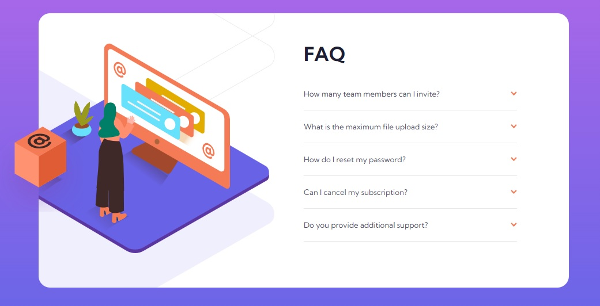

# Frontend Mentor - FAQ accordion card solution

This is a solution to the [FAQ accordion card challenge on Frontend Mentor](https://www.frontendmentor.io/challenges/faq-accordion-card-XlyjD0Oam). Frontend Mentor challenges help you improve your coding skills by building realistic projects. In this project I not use javaScript at all.

## Table of contents

- [Overview](#overview)
  - [The challenge](#the-challenge)
  - [Screenshot](#screenshot)
  - [Links](#links)
- [My process](#my-process)
  - [Built with](#built-with)
  - [What I learned](#what-i-learned)
  - [Useful resources](#useful-resources)
- [Author](#author)

## Overview

### The challenge

Users should be able to:

- View the optimal layout for the component depending on their device's screen size
- See hover states for all interactive elements on the page
- Hide/Show the answer to a question when the question is clicked

### Screenshot

### Links

- Live Site URL: [Add live site URL here](https://your-live-site-url.com)

## My process

### Built with

- Sass
- HTML

**Note: These are just examples. Delete this note and replace the list above with your own choices**

### What I learned

In this challenge I learned relative and absolute positioning backgraund images.

### Useful resources

- [relative and absolute positioning](https://www.youtube.com/watch?v=lUaw-AA9HnA) - This helped me.

## Author

- Frontend Mentor - [@edo979](https://www.frontendmentor.io/profile/edo979)
